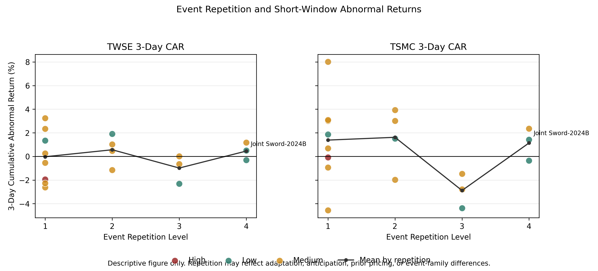

# Taiwan Geopolitical Risk Analytics & Dashboard

## Academic Research Notice

This repository contains research-oriented analytics tools, datasets, workflow documentation, and supporting materials developed for academic and educational purposes.

Any research notes, coding schemas, event classifications, findings summaries, or supporting documents should be treated as preliminary academic materials unless explicitly identified as peer-reviewed or formally published.

Nothing in this repository should be interpreted as investment advice, policy advice, or an official publication.

## One-Sentence Portfolio Positioning

This project turns a Taiwan geopolitical risk research question into an event-study analytics engine and dashboard-ready decision-support product.

## Research Question

```text
Why do some Taiwan-related geopolitical shocks produce negative financial-market reactions while others generate muted or positive abnormal returns?
```

The project studies Taiwan-related geopolitical events using event-study methodology, abnormal returns, cumulative abnormal returns, and structured event coding.

## Why Taiwan Grey-Zone Sovereignty Matters

Taiwan sits at the intersection of sovereignty disputes, U.S.-China strategic competition, semiconductor supply chains, and financial market risk.

Because Taiwan-related shocks recur, the market response may not be automatic. Investors may interpret events differently depending on whether they are novel, repeated, expected, strategically important, or already priced.

## Method Overview

The research and analytics workflow is:

```text
Identify Taiwan-related event
→ code event characteristics
→ align market data
→ calculate returns
→ calculate abnormal returns
→ calculate CAR
→ generate dashboard-ready outputs
→ review interpretation cautiously
```

The current engine calculates benchmark-adjusted abnormal CAR. For the current TSMC examples, the benchmark is SOX.

## Key Variables

| Variable | Purpose |
|---|---|
| `surprise_score` | Codes whether an event appears high, medium, or low surprise based on pre-event information. |
| `surprise_rationale` | Explains why the event received its surprise score. |
| `event_family` | Groups comparable events, such as military exercises, diplomatic shocks, economic coercion, or strategic investments. |
| `event_repetition_level` | Codes whether an event is novel or part of a repeated grey-zone pattern. |

These variables make the adaptation-versus-anticipation problem more explicit.

## Main Interpretation

The findings are **consistent with adaptation**, especially where repeated Taiwan-related shocks produce muted or less negative abnormal returns.

They are **not causal proof of adaptation**.

Market reactions may reflect both objective risk and investor interpretation. Anticipation, prior pricing, broader market conditions, benchmark sensitivity, and sample limitations remain important rival explanations.

## Key Figure

The most important public-facing figure is:



This figure is a descriptive diagnostic. It is suggestive evidence, not causal proof.

## Public Reading Path

Start here:

1. [README](README.md)
2. [Research Question](docs/public/01_research_question.md)
3. [Theory Framework](docs/public/02_theory_framework.md)
4. [Research Design](docs/public/03_research_design.md)
5. [Key Findings](docs/public/04_key_findings.md)
6. [Discussion and Limitations](docs/public/06_discussion_and_limitations.md)
7. [Portfolio Relevance](docs/public/07_portfolio_relevance.md)

For the full documentation map, see [docs/README.md](docs/README.md).

## Research → Analytics → Product

This repository supports a three-part portfolio narrative:

```text
Research
→ Analytics
→ Product
```

| Repository Role | Project | Portfolio Capability |
|---|---|---|
| Repo 1 | Grey-Zone Sovereignty and Market Adaptation | Research dissertation / writing sample |
| Repo 2 | Taiwan Geopolitical Risk Event Study Engine | Event-study analytics engine |
| Repo 3 | AI Geopolitical Risk Dashboard | Analytics product and decision-support dashboard |

## Dashboard and Analytics Outputs

Current portfolio-ready outputs include:

| Output | Purpose |
|---|---|
| `results/event_results.csv` | Master event-level CAR results |
| `results/dashboard_data.csv` | Dashboard-ready event table |
| `results/mechanism_summary.csv` | Mechanism-level CAR summary |
| `results/event_insights.json` | Deterministic rule-based insights |
| `results/historical_comparison.json` | Event-versus-mechanism comparison metadata |
| `results/executive_brief.json` | Deterministic analyst-style brief |
| `results/llm_context.json` | Structured context for future analyst-reviewed LLM use |

No OpenAI, Claude, Gemini, external APIs, forecasting, trading recommendations, or investment advice are used.

## Dashboard Screenshots

Executive dashboard:


Dashboard intelligence layer:


## How to Run

Install dependencies:

```bash
pip install -r requirements.txt
```

Run the event-study engine:

```bash
python3 scripts/run_event_study.py
```

Generate dashboard intelligence outputs:

```bash
python3 scripts/generate_event_insights.py
python3 scripts/generate_dashboard_intelligence.py
```

Run the dashboard locally:

```bash
python3 -m http.server 8000 --bind 127.0.0.1
```

Then open:

```text
http://127.0.0.1:8000/dashboard/
```

## Skills Demonstrated

- International relations
- Political economy
- Risk analytics
- Event study design
- Financial data analytics
- Analytics workflow design
- Dashboard product thinking
- AI-assisted research and product thinking
- Research-to-product transformation

## Portfolio Documentation

- [Portfolio Positioning](docs/portfolio_positioning.md)
- [Research to Product Story](docs/research_to_product_story.md)
- [Recruiter Summary](docs/recruiter_summary.md)
- [Repo 3 Case Study](docs/repo3_case_study.md)

## Roadmap

Completed:

- Dashboard V1
- Rule-based intelligence layer
- Portfolio documentation
- Public documentation layer

Future roadmap:

- Public demo deployment
- Analyst-reviewed LLM explanation layer
- Dashboard filters and event explorer
