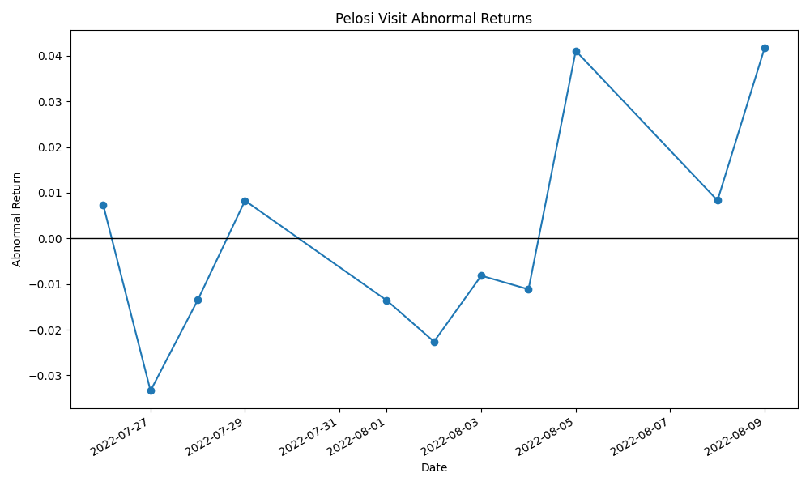
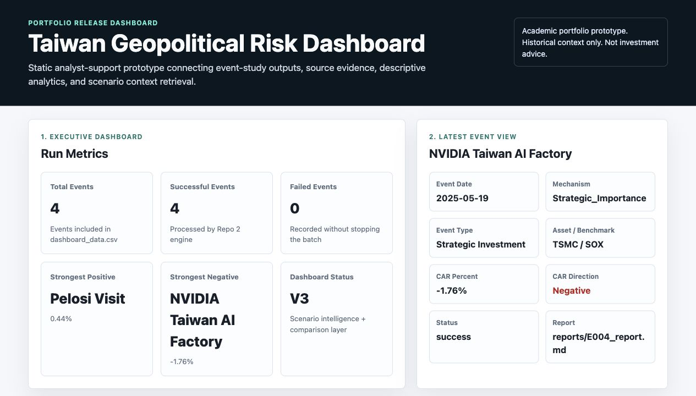
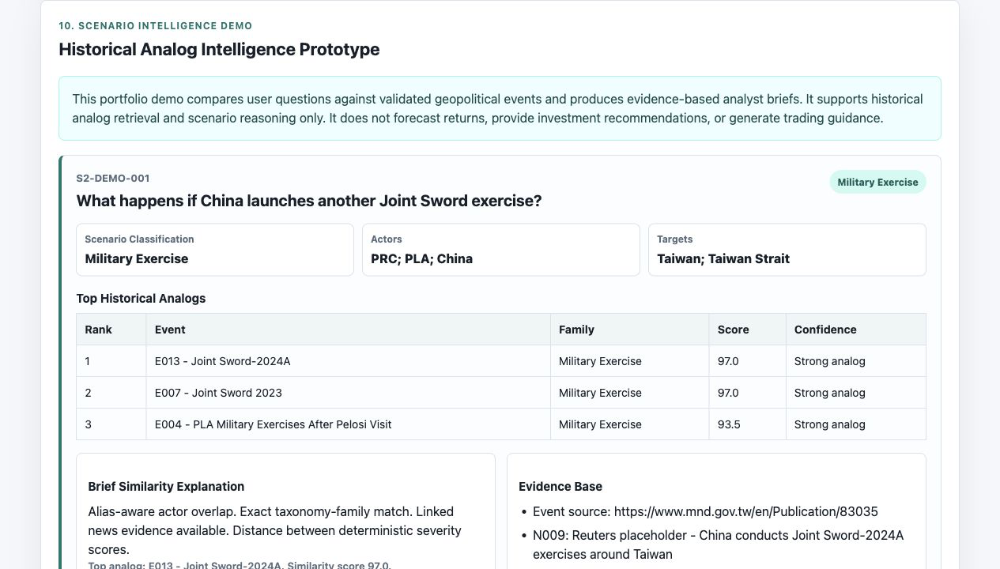

# Taiwan Geopolitical Risk Analytics & Dashboard

## Academic Research Notice

This repository contains research-oriented analytics tools, datasets, workflow documentation, and supporting materials developed for academic and educational purposes.

Any research notes, coding schemas, event classifications, findings summaries, or supporting documents should be treated as preliminary academic materials unless explicitly identified as peer-reviewed or formally published.

Nothing in this repository should be interpreted as investment advice, policy advice, or an official publication.

## One-Sentence Description

An automated event-study analytics engine and dashboard product that measures financial market responses to Taiwan-related geopolitical events and turns the outputs into decision-support insights.

## 30-Second Overview

This repository demonstrates a three-stage Business Analytics workflow:

```text
Repo 1: Taiwan geopolitical risk research
↓
Repo 2: Automated event-study analytics engine
↓
Repo 3: Dashboard-ready decision-support product
```

Current portfolio-ready capabilities:

- multi-event event-study engine
- benchmark-adjusted abnormal CAR calculation
- dashboard-ready CSV and JSON outputs
- single-page geopolitical risk dashboard
- deterministic rule-based insights
- historical event comparison metadata
- executive brief generation
- LLM-ready context layer for future analyst-reviewed AI use

No OpenAI, Claude, Gemini, external APIs, forecasting, trading recommendations, or investment advice are used.

## How The Repositories Connect

Repo 1 is the research foundation.

Repo 2 is the analytics engine built from that research workflow.

Repo 3 is the dashboard product built from Repo 2 outputs.

```text
Repo 1
Grey-Zone Sovereignty and Market Adaptation
Research Capability
↓
Repo 2
Taiwan Geopolitical Risk Event Study Engine
Analytics Engineering Capability
↓
Repo 3
AI Geopolitical Risk Dashboard
Analytics Product Capability
```

The portfolio narrative is:

```text
Research
→ Analytics
→ Product
```

## Business Problem

Geopolitical events can affect financial markets quickly, but manual event-study analysis is slow, difficult to repeat, and vulnerable to inconsistent workflow decisions.

Political risk analysts, financial research teams, and business analytics stakeholders need a repeatable workflow that can convert event metadata, market data, and event-window assumptions into structured outputs for review.

## Analytics Solution

This project transforms a manual Taiwan geopolitical-risk event study into an automated analytics engine.

The engine reads standardised event inputs, loads market data, calculates returns, calculates benchmark-adjusted abnormal returns, calculates cumulative abnormal return (CAR), and generates reusable CSV, figure, and Markdown report outputs.

Repo 2 is designed as an analytics product, not a research paper.

## Architecture Overview

```text
events/events.csv
data/market_data.csv
        ↓
Repo 2 Event Study Engine
        ↓
event_results.csv
dashboard_data.csv
mechanism_summary.csv
executive_summary.md
        ↓
Repo 3 Dashboard Intelligence Layer
        ↓
event_insights.json
historical_comparison.json
executive_brief.json
llm_context.json
        ↓
Repo 3 Dashboard V1
```

Repo 2 owns the event-study calculations.

Repo 3 owns the dashboard, deterministic interpretation layer, and portfolio-ready presentation.

## Current Status

V3 dashboard-ready analytics outputs are implemented on top of the V2 multi-event engine.

The engine currently:

- reads multiple events from `events/events.csv`
- processes each event in a batch loop
- preserves a clear `process_one_event(event)` boundary
- records success or failure for each event
- continues processing after event-level failures
- writes a run summary after each batch execution
- writes dashboard-ready event data
- writes a non-technical executive summary

## Workflow

```text
events/events.csv
↓
Load all events
↓
FOR EACH EVENT
    Load market data
    Calculate returns
    Calculate abnormal returns
    Calculate CAR
    Save event-window data
    Generate figure
    Generate report
    Record event status
↓
Write master results table
↓
Write mechanism summary
↓
Write dashboard data
↓
Write executive summary
↓
Write run summary
```

## Current Input Files

| Input | Path | Purpose |
|---|---|---|
| Event input | `events/events.csv` | Defines events, assets, benchmarks, and event windows |
| Market data | `data/market_data.csv` | Standardised market price data used by the engine |

Current event schema:

```csv
event_id,event_name,event_date,mechanism,event_type,asset,benchmark,event_window_start,event_window_end
```

## Current Outputs

| Output | Path | Purpose |
|---|---|---|
| Master event results | `results/event_results.csv` | One row per processed event |
| Mechanism summary | `results/mechanism_summary.csv` | Portfolio-level CAR summary by mechanism |
| Dashboard data | `results/dashboard_data.csv` | Dashboard-ready event table with CAR percent, direction, status, and output paths |
| Executive summary | `results/executive_summary.md` | Non-technical batch summary for business-facing review |
| Event-window data | `results/event_windows/{event_id}_event_window_data.csv` | Daily event-window returns and abnormal returns |
| Event figures | `figures/{event_id}_abnormal_returns.png` | Per-event abnormal return figure |
| Event reports | `reports/{event_id}_report.md` | Per-event analyst-facing Markdown report |
| Run summary | `results/run_summary.md` | Batch-level status summary |

The old V1 file `results/event_window_data.csv` is deprecated. V2 active event-window outputs are stored in `results/event_windows/`.

## Example Output Figure



## Example Report

The engine automatically generates one Markdown report per successful event.

Example:

[reports/E001_report.md](reports/E001_report.md)

## How to Run the Current Engine

Install dependencies:

```bash
pip install -r requirements.txt
```

Run the batch engine:

```bash
python3 scripts/run_event_study.py
```

If Matplotlib needs a writable cache location on your machine, set `MPLCONFIGDIR` before running the engine.

## Current Metric Definition

`car_value` is benchmark-adjusted abnormal CAR under the current engine definition.

The engine calculates:

```text
asset_return = asset daily percentage change
benchmark_return = benchmark daily percentage change
abnormal_return = asset_return - benchmark_return
car_value = sum of abnormal_return inside the event window
```

For the current TSMC examples, the benchmark is SOX.

Raw CAR is not yet implemented as a separate output field. It is planned as a future enhancement.

## Event-Level Failure Handling

The engine records a status for each event in `results/event_results.csv`.

Current status behaviour:

- `success`: the event processed successfully
- `failed`: the event failed, but the batch continued

Failed events are recorded with an `error_message` so the analyst can diagnose the problem without losing outputs for other events.

## Portfolio Analytics Layer

The engine also generates:

```text
results/mechanism_summary.csv
results/dashboard_data.csv
results/executive_summary.md
```

`results/mechanism_summary.csv` summarises `car_value` by mechanism using successful events for CAR statistics and counting failed events separately.

`results/dashboard_data.csv` and `results/executive_summary.md` translate the batch outputs into dashboard-ready and business-facing formats.

Current mechanism summary fields:

```text
mechanism
event_count
mean_car_value
min_car_value
max_car_value
successful_event_count
failed_event_count
```

## V3 Dashboard-Ready Analytics Layer

V3 adds two business-facing outputs without changing the core CAR calculation:

- `results/dashboard_data.csv` converts the master event results into a dashboard-friendly table with `car_percent`, `car_direction`, event status, and links to generated artifacts.
- `results/executive_summary.md` summarises the batch run for non-technical readers, including event counts, strongest positive and negative events, mechanism-level results, and a non-investment-advice note.

These files are designed to support a future Repo 3 dashboard or analytics interface.

## Repo 3: AI-Ready Geopolitical Risk Dashboard

Repo 3 adds the first runnable dashboard layer on top of the Repo 2 analytics engine.

The dashboard turns structured event-study outputs into a single-page decision-support view for a geopolitical risk analyst. Dashboard V1 displays batch KPIs, latest event context, the generated executive summary, deterministic rule-based insights, historical comparisons, an executive brief, and an intelligence overview.

Current Dashboard V1 status:

- Dashboard V1 is complete and runnable locally
- KPI cards load from `results/dashboard_data.csv`
- latest event view loads from `results/dashboard_data.csv`
- executive summary renders from `results/executive_summary.md`
- Insight Panel displays rule-based educational insights from `results/event_insights.json`
- historical comparison loads from `results/historical_comparison.json`
- executive brief loads from `results/executive_brief.json`
- LLM-ready context summary loads from `results/llm_context.json`
- rule-based intelligence layer is complete
- portfolio documentation is complete
- no LLM integration, forecasting, trading recommendation, or complex filtering is included

Repo 3 consumes these Repo 2 outputs:

```text
results/dashboard_data.csv
results/executive_summary.md
results/mechanism_summary.csv
```

Repo 3 generated intelligence outputs:

```text
results/event_insights.json
results/historical_comparison.json
results/executive_brief.json
results/llm_context.json
```

## Repo 2 to Repo 3 Workflow

```text
Run Repo 2 engine
↓
Generate dashboard_data.csv and mechanism_summary.csv
↓
Generate rule-based event insights
↓
Generate historical comparisons, executive brief, and LLM-ready context
↓
Open Dashboard V1
↓
Review metrics, event context, executive brief, and deterministic insights
```

Run the dashboard intelligence generators:

```bash
python3 scripts/generate_event_insights.py
python3 scripts/generate_dashboard_intelligence.py
```

## Feature Summary

| Feature | Output / Location | Purpose |
|---|---|---|
| KPI cards | Dashboard V1 | Summarize events, failures, and strongest reactions |
| Latest Event View | Dashboard V1 | Show current event metadata and CAR direction |
| Executive Summary | `results/executive_summary.md` | Non-technical batch summary |
| Rule-Based Insights | `results/event_insights.json` | Deterministic insight cards |
| Historical Comparison | `results/historical_comparison.json` | Compare event CAR with mechanism averages |
| Executive Brief | `results/executive_brief.json` | Deterministic analyst-style summary |
| LLM-Ready Context | `results/llm_context.json` | Structured future AI context with usage constraints |

## Dashboard Description

Dashboard V1 is a single-page portfolio dashboard for geopolitical risk analysis.

It is designed to help an analyst move from event-study output files to a stakeholder-ready view without manual inspection of every CSV, JSON, and Markdown artifact.

The dashboard is intentionally deterministic in this version. It supports explainability and analyst review rather than automated decision-making.

## Dashboard Screenshots

Executive dashboard:



Dashboard intelligence layer:



## Rule-Based Insight Generator

Repo 3 includes a deterministic insight generator that creates explainable dashboard insights without using any LLM APIs.

The generator reads:

```text
results/dashboard_data.csv
results/mechanism_summary.csv
```

It writes:

```text
results/event_insights.json
```

Run it from the repository root:

```bash
python3 scripts/generate_event_insights.py
```

The current rules identify:

- positive reaction despite `Risk` classification
- negative reaction despite `Strategic_Importance` classification
- reaction stronger than the mechanism average
- reaction weaker than the mechanism average

The output is deterministic, explainable, and intended for educational and research use only. It does not use OpenAI, Claude, or any external API. It does not provide forecasts, trading recommendations, investment advice, policy advice, or official conclusions.

## Future AI Roadmap

Future AI work may use `results/llm_context.json` as structured context for analyst-reviewed explanations.

Planned AI direction:

- event explanation drafts
- mechanism interpretation drafts
- caveat checklists
- executive brief drafting
- analyst-editable insight text

Guardrails:

- use only structured project outputs
- clearly label generated text as draft interpretation
- avoid forecasting
- avoid trading recommendations
- avoid investment or policy advice

Run the dashboard locally from the repository root:

```bash
python3 -m http.server 8000 --bind 127.0.0.1
```

Then open:

```text
http://127.0.0.1:8000/dashboard/
```

## Skills Demonstrated

- Business Analytics Workflow Design
- Financial Data Analytics
- Event Study Methodology
- Research Automation
- Python Analytics Pipeline
- Batch Processing
- Portfolio-Level Analytics
- Report Generation
- Validation and Metric Definition
- Research-to-Product Transformation

## Portfolio Documentation

Additional portfolio-facing documentation:

- [Portfolio Positioning](docs/portfolio_positioning.md)
- [Research to Product Story](docs/research_to_product_story.md)
- [Recruiter Summary](docs/recruiter_summary.md)
- [Repo 3 Case Study](docs/repo3_case_study.md)

## Roadmap

Completed:

- Dashboard V1
- Rule-based intelligence layer
- Portfolio documentation

Future roadmap:

- Public demo deployment
- Analyst-reviewed LLM explanation layer
- Dashboard filters and event explorer
