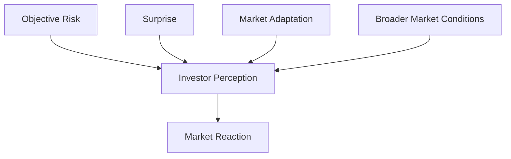

# Main Findings V1

## Purpose

This document synthesizes the current empirical findings from the first event-window analyses.

It is written as an early draft that could later become the findings section of a conference paper or master's research paper.

Events included:

1. Pelosi Visit.
2. Joint Sword 2023.
3. Joint Sword-2024A.
4. Joint Sword-2024B.

The analysis uses raw TWSE and TSMC returns over -7 to +7 trading-day windows.

---

## 1. Key Findings

The first empirical results show that Taiwan financial-market reactions to geopolitical events are uneven rather than mechanically negative.

The Pelosi Visit produced the clearest event-day disruption. TWSE fell by 1.56% and TSMC fell by 2.38% on the event day. This supports the idea that diplomatic crises can create immediate market stress when they are perceived as highly salient or surprising.

Military exercises produced more mixed results. Joint Sword 2023 had a weakly positive TWSE event-day return but a negative TSMC event-day return and a strongly negative TSMC window return. In contrast, Joint Sword-2024A and Joint Sword-2024B both showed positive window returns for TWSE and TSMC.

The evidence suggests that market reaction depends on more than objective event severity. Investor expectations, event repetition, broader market conditions, and perceived containment likely shape whether geopolitical risk produces a negative market response.

---

## 2. Event Comparison Table

| Event | Event Date | TWSE Day-0 Return | TWSE Window Return | TSMC Day-0 Return | TSMC Window Return |
| --- | --- | ---: | ---: | ---: | ---: |
| Pelosi Visit | 2022-08-02 | -1.56% | 1.74% | -2.38% | 2.59% |
| Joint Sword 2023 | 2023-04-08 | 0.25% | -0.91% | -0.38% | -5.38% |
| Joint Sword-2024A | 2024-05-23 | 0.26% | 3.26% | 1.27% | 3.30% |
| Joint Sword-2024B | 2024-10-14 | 0.32% | 2.24% | 0.00% | 6.00% |

Notes:

1. Joint Sword 2023 occurred on 2023-04-08, which was not a trading day. The analysis uses 2023-04-10 as the event trading date.
2. All returns are raw returns, not abnormal returns.
3. Window returns are cumulative returns over -7 to +7 trading days.

---

## 3. Evidence Supporting the Adaptation Model

The adaptation model argues that repeated geopolitical pressure may lose market shock value over time.

The current evidence is consistent with this possibility:

1. The Pelosi Visit in 2022 generated a sharp negative event-day reaction.
2. Joint Sword 2023 generated a weaker day-0 reaction but a negative TSMC window return.
3. Joint Sword-2024A generated positive event-day and window returns.
4. Joint Sword-2024B also generated positive window returns, especially for TSMC.

This pattern suggests that markets may have become more accustomed to PLA exercise patterns after 2022. Investors may interpret some exercises as coercive signaling rather than immediate conflict.

However, this interpretation is not proven. Positive 2024 returns could also reflect broader market momentum, semiconductor-sector strength, or AI-related optimism.

Future tests should compare raw returns with benchmark-adjusted abnormal returns.

---

## 4. Evidence Against a Simple Risk Model

A simple risk model would predict that higher military-risk events should produce more negative market reactions.

The current evidence does not support that simple version.

Joint Sword-2024A and Joint Sword-2024B are both high military-risk events, but both had positive TWSE and TSMC window returns. This means `military_risk` alone cannot explain market reaction.

The Pelosi Visit was primarily coded as a diplomatic crisis, yet it produced the strongest negative event-day response. This suggests that surprise and political salience may matter as much as, or more than, formal event category.

The results point toward a filtered model:

---

## 5. Implications for Grey-Zone Sovereignty Theory

The grey-zone sovereignty framework remains useful, but it should be revised.

The original framework treated Taiwan's contested sovereignty as a source of geopolitical risk that could affect financial markets. The first empirical results support the broad idea that sovereignty-related events matter, but they complicate the mechanism.

Taiwan's grey-zone sovereignty creates persistent exposure to diplomatic and military pressure. But market effects depend on how investors interpret each episode.

Revised theoretical implication:

Taiwan's grey-zone sovereignty creates a standing risk environment, but market outcomes are filtered through perceived escalation, surprise, repetition, and strategic importance.

This matters especially for TSMC. TSMC appears both exposed to geopolitical risk and supported by Taiwan's strategic importance in semiconductor and AI supply chains. In some windows, this strategic role may offset or reverse negative risk effects.

The theory should therefore distinguish between:

1. Objective geopolitical risk.
2. Perceived market risk.
3. Surprise or novelty.
4. Market adaptation.
5. Strategic investment and resilience.

---

## 6. Remaining Uncertainties

The current findings are preliminary.

Important limitations remain:

1. The analysis includes only four events.
2. The results use raw returns, not abnormal returns.
3. There is no benchmark market yet, such as NASDAQ, MSCI Asia, or a semiconductor index.
4. USD/TWD is not yet included in the cleaned market dataset.
5. The event windows do not yet control for broader macroeconomic or technology-market conditions.
6. Event scoring still has `confidence_level = TBD` and `source = TBD`.
7. Some events may have been anticipated before the event date.

Future analysis should:

1. Add NASDAQ, NVIDIA, and USD/TWD data.
2. Build abnormal-return models.
3. Add more military, sanctions, investment, and diplomatic events.
4. Code surprise or prior expectation.
5. Test whether repeated PLA exercises show declining market impact.
6. Compare TSMC responses against broader TWSE responses.

## Bottom Line

The first empirical findings suggest that Taiwan geopolitical-risk events do affect markets, but not in a simple linear way.

The strongest early conclusion is that market reaction depends on whether risk is surprising, perceived as escalating, or already absorbed by investors.

This supports revising the project from a simple geopolitical-risk model to a grey-zone sovereignty model filtered by perception, adaptation, and strategic importance.

