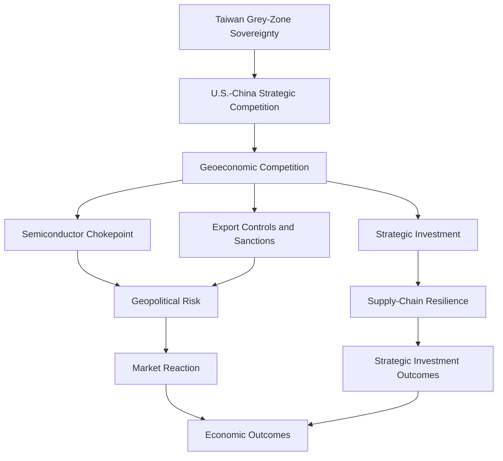

# Taiwan Geoeconomics and Strategic Investment Note

## Purpose

This file records research notes and source leads for geoeconomics, U.S.-China competition, Taiwan's semiconductor role, and strategic investment as a geopolitical-risk channel.

These concepts help connect the project's sovereignty framework to market reactions and strategic investment outcomes.

## Search Terms

- Geoeconomics Taiwan
- US China competition geoeconomics
- Strategic investment geopolitical risk

## Core Argument

Taiwan sits at the intersection of geopolitics and geoeconomics:

1. Taiwan's contested sovereignty makes it a geopolitical flashpoint.
2. Taiwan's semiconductor role makes it a geoeconomic chokepoint.
3. U.S.-China competition turns technology supply chains into instruments of power.
4. Strategic investment, export controls, and supply-chain relocation become tools for managing risk.
5. Markets react not only to military events, but also to shifts in technology policy, investment, and supply-chain security.

## Key Concepts

| Concept | Definition | Project Role |
| --- | --- | --- |
| Geoeconomics | The use of economic instruments and dependencies for geopolitical or security goals. | Connects U.S.-China competition, export controls, investment policy, and Taiwan's semiconductor role. |
| Strategic investment | Investment motivated partly by national security, supply-chain resilience, or geopolitical positioning. | Explains TSMC Arizona, NVIDIA Taiwan AI factory, CHIPS Act, and related events. |
| Semiconductor chokepoint | A concentrated point in the chip supply chain whose disruption would affect global technology and defense systems. | Explains why Taiwan creates both strategic leverage and systemic risk. |
| Silicon shield | The argument that Taiwan's semiconductor importance may deter conflict or attract foreign support. | Useful but contested concept for linking strategic importance and security outcomes. |
| Supply-chain resilience | Policies and investments designed to reduce vulnerability to disruption. | Connects strategic investment to economic outcomes. |

## Source Leads

| Source | Use in Project | Notes |
| --- | --- | --- |
| CFR, Will China's Reliance on Taiwanese Chips Prevent a War? | Silicon shield and conflict risk | Argues Taiwan's chip dominance raises costs of conflict but does not eliminate risk. |
| Stimson Center, Semiconductors and Taiwan's Silicon Shield | Semiconductor strategy | Explains how Taiwan's chip dominance affects U.S.-China-Taiwan dynamics. |
| CSIS, Silicon Island | Taiwan importance to U.S. economic growth and security | Useful for connecting Taiwan's semiconductor role to U.S. economic-security interests. |
| U.S.-Taiwan Business Council / Project 2049, U.S., Taiwan, and Semiconductors | Supply-chain partnership | Supports Taiwan-U.S. semiconductor partnership and disruption-risk framing. |
| Global Taiwan Institute, A Geoeconomic Strategy for Enhancing the U.S.-Taiwan Partnership | Geoeconomic strategy | Connects Taiwan partnership to geoeconomic competition with China. |
| Wigell et al. (2018), Geo-economics and Power Politics in the 21st Century | Geoeconomics theory | Core theory source for economic tools and power politics. |
| Baldwin (2020), Economic Statecraft | Economic power theory | Explains economic instruments as tools of state power. |
| CHIPS Act / U.S. Commerce sources | Strategic investment and industrial policy | Supports coding of TSMC Arizona and supply-chain resilience events. |
| BIS export-control sources | Technology controls | Supports coding of semiconductor export controls as geoeconomic instruments. |

## Mechanism

## Project Implications

| Research Area | Implication |
| --- | --- |
| Geopolitical risk | Military and diplomatic events matter, but economic policy tools can also create geopolitical-risk shocks. |
| Strategic importance | Taiwan's semiconductor and AI role increases its value to the United States, China, and global markets. |
| Market reaction | Markets may react to both crisis events and policy/investment announcements. |
| Strategic investment | Investment announcements can reflect risk mitigation, supply-chain resilience, and alliance coordination. |
| Financial statecraft | Export controls and sanctions are geoeconomic tools, not just legal events. |

## Coding Implications

This concept supports the following `data/events_v1.csv` fields:

| Field | Geoeconomic Link |
| --- | --- |
| `event_category` | Investment, export control, sanctions, industrial policy, military crisis, diplomatic crisis. |
| `sanctions_risk` | Captures financial-statecraft and technology-control events. |
| `semiconductor_relevance` | Captures events tied to chips, fabs, supply chains, and TSMC. |
| `ai_relevance` | Captures events tied to AI compute, NVIDIA, data centers, and advanced chips. |
| `security_relevance` | Captures the national-security logic of economic policy and investment. |
| `diplomatic_risk` | Captures alliance, recognition, and U.S.-China signaling dimensions. |

## Candidate Event Types

| Event Type | Example |
| --- | --- |
| Strategic investment | TSMC Arizona expansion, NVIDIA-Foxconn Taiwan AI factory. |
| Industrial policy | CHIPS and Science Act, TSMC CHIPS Act preliminary terms. |
| Export controls | October 2022 BIS advanced semiconductor restrictions. |
| Sanctions / financial statecraft | OFAC Chinese Military-Industrial Complex sanctions, Huawei / SMIC restrictions. |
| Military escalation | Pelosi-related PLA drills, Joint Sword exercises. |

## Research Notes

1. Geoeconomics links economic dependence to security competition.
2. Taiwan's semiconductor role creates leverage and vulnerability at the same time.
3. Strategic investment should not automatically be treated as a market-positive event; it may also signal perceived risk.
4. Export controls and sanctions should be coded separately from corporate investment events.
5. The project should distinguish between immediate market reaction and longer-term strategic investment outcomes.

