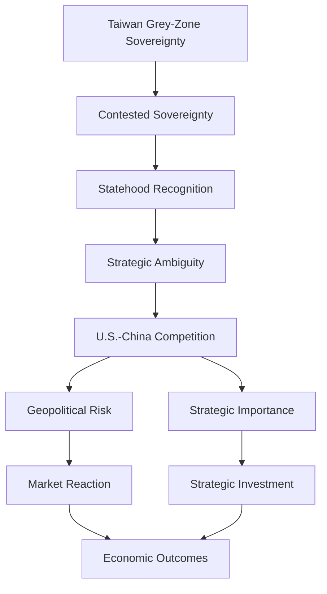

# Taiwan Grey-Zone Sovereignty Note

## Purpose

This file records conceptual notes for Taiwan grey-zone sovereignty, contested sovereignty, and statehood recognition.

These concepts provide the theoretical foundation for the project. They explain why Taiwan-related events can generate geopolitical risk even when Taiwan has strong domestic state capacity, democratic institutions, and economic importance.

## Search Terms / Concepts

- Taiwan grey zone sovereignty
- Taiwan contested sovereignty
- Taiwan statehood recognition

## Core Concept

Taiwan occupies a grey-zone sovereignty position:

1. It has many features of statehood, including territory, population, government, elections, armed forces, and foreign economic relations.
2. Its international legal and diplomatic status remains contested.
3. Recognition by other states is limited and politically constrained by the People's Republic of China's sovereignty claim.
4. U.S.-China competition makes Taiwan's status strategically important and geopolitically sensitive.

## Conceptual Definitions

| Concept | Definition | Project Role |
| --- | --- | --- |
| Grey-zone sovereignty | A condition in which an entity has substantial state-like authority and capacity but lacks full or uncontested international recognition. | Explains why Taiwan's political status creates persistent geopolitical risk. |
| Contested sovereignty | A situation where sovereignty claims are disputed by competing political authorities or states. | Explains the PRC-ROC sovereignty dispute and its role in cross-strait tension. |
| Statehood recognition | The process by which other states acknowledge an entity as a state or legitimate sovereign actor. | Connects Taiwan's status to international recognition, diplomatic constraints, and strategic ambiguity. |
| Strategic ambiguity | Deliberate uncertainty in U.S. policy regarding how it would respond to a Taiwan contingency. | Links Taiwan's status to deterrence, uncertainty, and market risk. |

## Theory Stack Connection

## Source Connections

| Source | Concept | Use in Project |
| --- | --- | --- |
| Wendt (1992) | Recognition / social construction of sovereignty | Supports the idea that sovereignty depends partly on intersubjective recognition by other states. |
| Shen (2000) | Statehood and Taiwan | Provides Taiwan-specific sovereignty and statehood discussion. |
| Chiang (2025) | Taiwan sovereignty | Provides modern Taiwan sovereignty framing. |
| PRC MFA (2024) | PRC official position | Primary source for China's claim over Taiwan. |
| ROC MOFA (2022) | Taiwan official position | Primary source for Taiwan's position. |
| Mearsheimer (2025) | Great-power competition | Connects Taiwan's status to U.S.-China strategic constraints. |
| Bellocchi (2023) | Strategic importance of Taiwan | Connects contested sovereignty to Taiwan's strategic value for the United States and allies. |

## Project Implications

Taiwan's grey-zone sovereignty can affect financial markets through several channels:

| Channel | Mechanism | Possible Market Indicator |
| --- | --- | --- |
| Diplomatic uncertainty | Recognition disputes and high-profile visits can trigger PRC responses. | TAIEX, TSMC, USD/TWD. |
| Military escalation | PLA exercises or blockade scenarios increase perceived security risk. | TAIEX volatility, USD/TWD, CDS spreads. |
| Strategic investment | Taiwan's semiconductor role attracts investment and policy support. | TSMC price, investment announcement count. |
| Financial statecraft | U.S.-China sanctions and export controls reshape technology supply chains. | Semiconductor equities, USD/TWD, event counts. |

## Coding Implications

This concept supports the following fields in `data/events_v1.csv`:

| Field | Connection |
| --- | --- |
| `diplomatic_risk` | Recognition disputes, official statements, visits, and sovereignty claims. |
| `military_risk` | PLA exercises, blockade scenarios, and coercive military signaling. |
| `security_relevance` | Taiwan's role in U.S.-China competition and regional security. |
| `semiconductor_relevance` | Taiwan's centrality in global chip supply chains. |
| `ai_relevance` | Taiwan's role in AI compute infrastructure through TSMC, NVIDIA, and related investments. |

## Research Notes

1. Grey-zone sovereignty is not the same as weak state capacity. Taiwan has strong internal governance but contested external recognition.
2. Contested sovereignty helps explain why symbolic events, such as visits or speeches, can generate material market reactions.
3. Statehood recognition links legal status, diplomacy, and market risk.
4. Strategic ambiguity can reduce or increase market uncertainty depending on how investors interpret deterrence.
5. This concept should be used as theory, not as a directly measured market variable.

