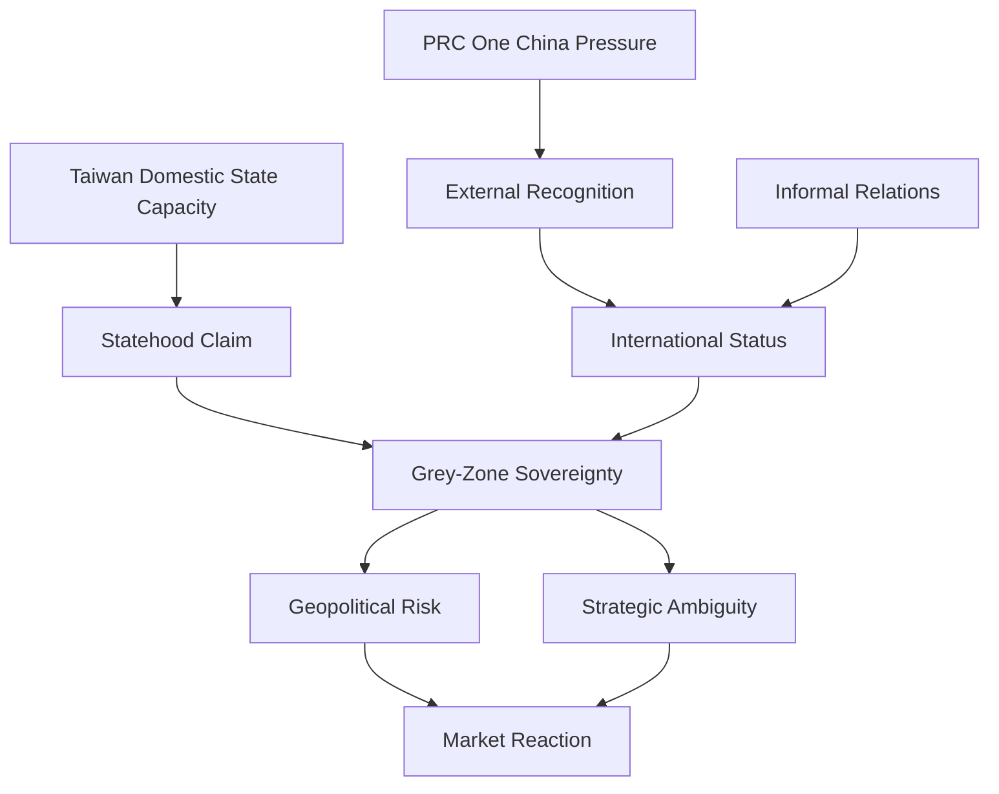

# Taiwan Recognition and Constructivism Note

## Purpose

This file records conceptual notes and source leads for Taiwan international recognition, recognition theory, and constructivist approaches to Taiwan sovereignty.

These concepts support the project's grey-zone sovereignty framework. They explain why Taiwan's status is not only a legal or military issue, but also a social and diplomatic condition shaped by recognition, identity, and international practice.

## Search Terms

- Taiwan international recognition
- Recognition theory Taiwan
- Constructivism Taiwan sovereignty

## Core Argument

Taiwan's sovereignty problem can be understood through recognition theory and constructivism:

1. Taiwan has strong internal state capacity and democratic governance.
2. Taiwan's external recognition is limited and contested.
3. Recognition by other states helps construct sovereignty as a social and diplomatic status.
4. The PRC's One China position and diplomatic pressure constrain how other states recognize or engage Taiwan.
5. Informal relations, representative offices, trade ties, and security cooperation create partial or practical recognition even without formal diplomatic recognition.

## Key Concepts

| Concept | Definition | Project Role |
| --- | --- | --- |
| International recognition | Formal or informal acknowledgment of a political entity's status by other states or international organizations. | Explains Taiwan's diplomatic constraints and grey-zone status. |
| Recognition theory | A theory that sovereignty and status depend partly on acknowledgment by other actors. | Links Taiwan sovereignty to social and diplomatic practice. |
| Constructivism | An international relations approach emphasizing identities, norms, meanings, and social construction. | Explains why sovereignty is not only material power, but also shared understanding and recognition. |
| Dynamic sovereignty | A view of sovereignty as changing in quality and quantity across time and contexts. | Useful for Taiwan because recognition can vary across diplomatic, economic, legal, and security domains. |
| Informal recognition | Practical engagement without formal diplomatic recognition. | Explains how Taiwan maintains broad unofficial ties despite limited formal allies. |

## Source Leads

| Source | Use in Project | Notes |
| --- | --- | --- |
| Taiwan Ministry of Foreign Affairs, Diplomatic Allies | Current official source | Use for the live list of formal diplomatic allies and overseas missions. |
| AP News, Nauru switches diplomatic recognition from Taiwan to China | Recognition-change source | Reports that Nauru's January 2024 switch reduced Taiwan's diplomatic allies to 12. Verify current count against MOFA before citing. |
| Wendt (1992), Anarchy Is What States Make of It | Constructivist theory | Supports the claim that state identities and interests are socially constructed. |
| Kyris (2022), State recognition and dynamic sovereignty | Recognition theory | Useful for theorizing fluctuating recognition and partial sovereignty. |
| Rich and Banerjee (2015), Taiwan's Relations in Africa | Taiwan recognition case literature | Discusses Taiwan's diplomatic recognition problem and why recognition matters for sovereignty. |
| Hsieh, Rethinking Non-Recognition | Taiwan non-recognition and One China policy | Useful for informal relations, status, and recognition under One China constraints. |
| ROC MOFA official position sources | Taiwan primary source | Use for Taiwan's own framing of its international status. |
| PRC MFA official position sources | PRC primary source | Use for China's official sovereignty claim and One China framing. |

## Recognition as a Mechanism

## Project Implications

| Research Area | Implication |
| --- | --- |
| Grey-zone sovereignty | Taiwan's status is neither simple full recognition nor simple non-statehood; it is contested and partially recognized across domains. |
| Geopolitical risk | Recognition-related events can trigger diplomatic or military reactions, especially when they challenge PRC red lines. |
| Market reaction | Recognition disputes may affect TAIEX, TSMC, USD/TWD, and sovereign-risk indicators through uncertainty and escalation risk. |
| Strategic investment | Taiwan's technological importance can create practical recognition even when formal recognition is limited. |

## Coding Implications

Recognition-related events can support these `data/events_v1.csv` fields:

| Field | Recognition Link |
| --- | --- |
| `event_category` | Diplomatic recognition, official visit, sovereignty statement, international organization participation, informal recognition. |
| `diplomatic_risk` | Recognition shifts, sovereignty statements, or official visits can raise diplomatic tension. |
| `military_risk` | Recognition-related events may trigger PLA exercises or coercive signaling. |
| `security_relevance` | Recognition disputes are central to U.S.-China-Taiwan security dynamics. |
| `semiconductor_relevance` | Taiwan's strategic industry role may produce practical recognition through economic dependence. |

## Research Notes

1. Do not treat recognition as a fixed binary variable unless the analysis specifically uses formal diplomatic allies.
2. Separate formal diplomatic recognition from informal political, economic, and security recognition.
3. Recognition counts can change. Verify the current list through Taiwan MOFA before citing a number.
4. A constructivist framing helps explain why symbolic diplomatic acts can create material risk.
5. Recognition theory supports the project's link between grey-zone sovereignty and market uncertainty.

