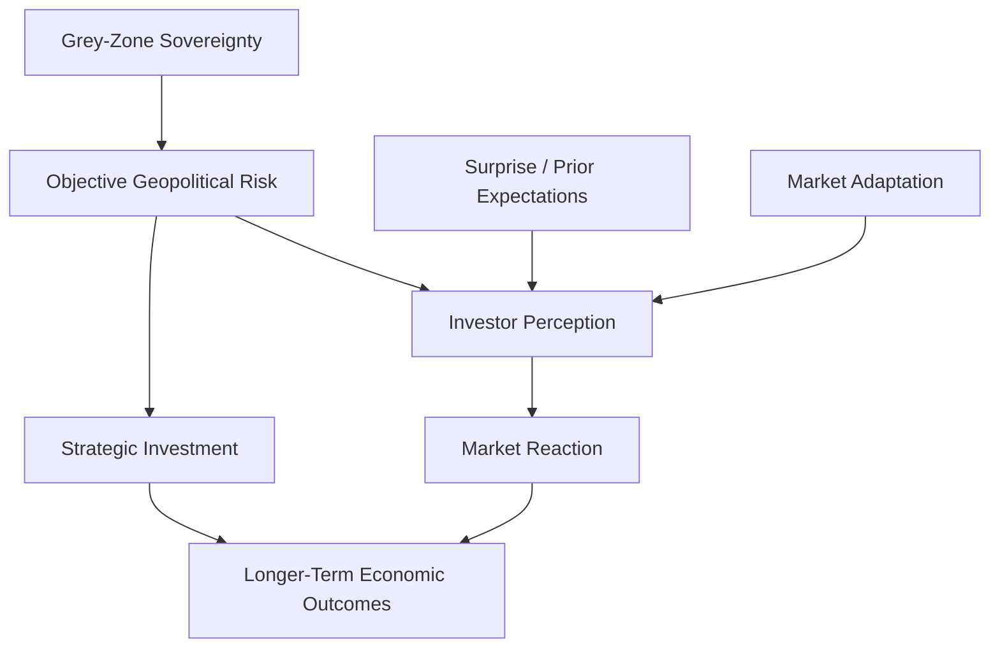

# Theory Revision Notes

## Purpose

This memo reassesses the original theoretical framework using the first empirical findings from the event-window analysis.

The current evidence comes from four events:

1. Pelosi Visit on 2022-08-02.
2. Joint Sword 2023 on 2023-04-08.
3. Joint Sword-2024A on 2024-05-23.
4. Joint Sword-2024B on 2024-10-14.

The analysis uses raw TWSE and TSMC returns over -7 to +7 trading-day windows.

---

## 1. Does `military_risk` Alone Explain Market Reactions?

Short answer:
No. `military_risk` alone does not explain the observed market reactions.

Supporting evidence:

| Event | Risk Type | TWSE Day-0 | TWSE Window | TSMC Day-0 | TSMC Window |
| --- | --- | ---: | ---: | ---: | ---: |
| Pelosi Visit | Diplomatic crisis | -1.56% | 1.74% | -2.38% | 2.59% |
| Joint Sword 2023 | Military exercise | 0.25% | -0.91% | -0.38% | -5.38% |
| Joint Sword-2024A | Military exercise | 0.26% | 3.26% | 1.27% | 3.30% |
| Joint Sword-2024B | Military exercise | 0.32% | 2.24% | 0.00% | 6.00% |

Competing explanations:

1. Military risk matters, but only when it is unexpected.
2. Markets may distinguish between symbolic coercion and genuine escalation.
3. Broader market conditions may dominate short event windows.
4. TSMC may respond differently from the broader TWSE index.
5. Investors may have adapted to repeated PLA exercises.

Future tests:

1. Add more military events beyond Joint Sword-2024B.
2. Add benchmark returns such as NASDAQ or MSCI Asia.
3. Measure abnormal returns rather than raw returns.
4. Compare military events with diplomatic and sanctions events.

---

## 2. Why Did Joint Sword-2024A and 2024B Generate Positive Window Returns Despite High Military-Risk Coding?

Joint Sword-2024A and Joint Sword-2024B are theoretically important because they show that a high `military_risk` score does not automatically produce negative market returns.

Possible explanations:

| Explanation | Logic | Evidence Needed |
| --- | --- | --- |
| Anticipation | Markets may have expected a PLA response after Lai's inauguration. | News expectations before 2024-05-23. |
| Containment | Investors may have viewed the exercise as limited and symbolic. | Official statements, exercise duration, absence of direct conflict. |
| Market adaptation | Repeated PLA exercises may have reduced the shock value. | Compare 2022, 2023, 2024A, and 2024B events. |
| Broader market momentum | Positive equity trends may have offset geopolitical risk. | NASDAQ, regional equity indexes, semiconductor index. |
| TSMC-specific resilience | TSMC may benefit from strategic demand despite geopolitical risk. | TSMC news, chip-sector performance, AI demand indicators. |

Preliminary interpretation:
Joint Sword-2024A and Joint Sword-2024B suggest the market reaction depends not only on objective military activity, but also on how investors interpret the event.

---

## 3. Should the Project Distinguish Objective Risk, Perceived Risk, and Surprise?

Yes. The first results suggest the project should distinguish at least three concepts.

| Concept | Definition | Possible Measurement |
| --- | --- | --- |
| Objective risk | Observable event severity, such as military exercises, missiles, sanctions, or export controls. | `military_risk`, `sanctions_risk`, event category. |
| Perceived risk | How investors interpret the event's danger or economic relevance. | Market returns, volatility, CDS spreads, USD/TWD, news tone. |
| Surprise | Whether the event was unexpected relative to market expectations. | Pre-event news, prediction markets, analyst commentary, abnormal returns. |

Theoretical implication:
Grey-zone sovereignty creates persistent objective risk, but market reactions depend on perceived risk and surprise.

Revised causal sequence:

---

## 4. Does Market Adaptation Help Explain Variation Across Events?

Yes, market adaptation is a plausible explanation.

Supporting pattern:

1. Pelosi Visit produced a sharp negative event-day reaction.
2. Joint Sword 2023 showed a negative TSMC window return but not a sharp TWSE day-0 selloff.
3. Joint Sword-2024A showed positive day-0 and window returns.
4. Joint Sword-2024B showed positive TWSE and TSMC window returns, with a stronger TSMC window result.

Interpretation:
Markets may have become more accustomed to PLA exercise patterns after 2022. If investors increasingly view exercises as coercive signaling rather than immediate conflict, market reaction may weaken.

Competing explanation:
The positive Joint Sword-2024A and Joint Sword-2024B results may reflect broader market momentum rather than adaptation. This cannot be resolved without benchmark controls.

Future tests:

1. Compare event reactions chronologically from 2022 to 2025.
2. Add a benchmark-adjusted abnormal-return model.
3. Add volatility measures, not just returns.
4. Test whether repeated event types show declining market impact.

---

## 5. How Should the Grey-Zone Sovereignty Framework Be Revised?

Original framework:

Grey-zone sovereignty creates strategic ambiguity and U.S.-China competition, which generate geopolitical risk and market reactions.

Revised framework:

Grey-zone sovereignty creates persistent geopolitical exposure, but market reactions are filtered through perception, surprise, adaptation, and strategic investment.

Revised claims:

1. Taiwan's contested sovereignty creates a standing risk environment.
2. Not every high-risk event produces negative market returns.
3. Market response depends on the event's novelty, expectedness, and perceived escalation path.
4. Strategic importance can offset risk by attracting investment and policy support.
5. TSMC may act both as a risk-exposed asset and as a strategic-resilience asset.

## Competing Explanations

| Explanation | Prediction | Future Test |
| --- | --- | --- |
| Objective-risk model | Higher risk scores should produce more negative returns. | Regress returns on `military_risk`, `diplomatic_risk`, and `sanctions_risk`. |
| Surprise model | Unexpected events should produce stronger reactions than expected events. | Code pre-event expectation and compare abnormal returns. |
| Adaptation model | Repeated PLA exercises should have weaker effects over time. | Compare Pelosi, Joint Sword 2023, 2024A, and 2024B. |
| Strategic-resilience model | Semiconductor/investment events may produce positive returns despite geopolitical risk. | Compare TSMC reaction to investment and military events. |
| Benchmark-momentum model | Raw returns reflect global market conditions more than event effects. | Add NASDAQ and regional benchmark abnormal returns. |

## Future Tests

1. Add NASDAQ and NVIDIA data to separate Taiwan-specific effects from global technology-market effects.
2. Add USD/TWD to measure currency-market risk perception.
3. Add additional military exercise cases beyond Joint Sword-2024B.
4. Add sanctions and export-control events to test financial-statecraft effects.
5. Create abnormal-return models using benchmark market returns.
6. Code `surprise_level` as a new variable.
7. Code `market_adaptation` or `event_repetition` as a new variable.

## Bottom Line

The first empirical results do not reject the grey-zone sovereignty framework, but they show that it is incomplete.

The framework should move from a simple risk-to-market-reaction model to a filtered model:

Grey-zone sovereignty creates objective exposure, but market outcomes depend on perception, surprise, adaptation, and strategic investment.
