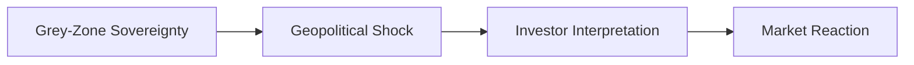
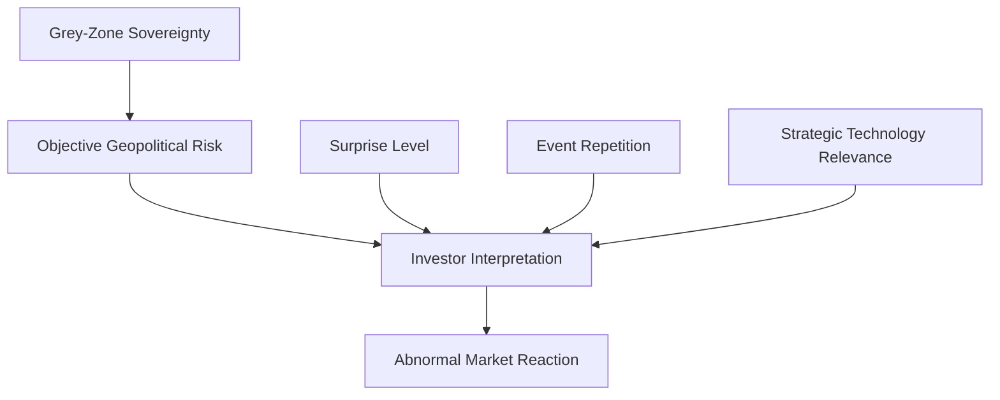

# Research Design V2

## Purpose

This memo updates the research design after the first empirical event-study findings.

The early results suggest that high geopolitical risk does not consistently produce negative market reactions. The v2 design therefore adds investor-interpretation variables that may explain why markets react differently across similar geopolitical events.

## 1. Current Theory

Current causal framework:

Core claim:

Taiwan's grey-zone sovereignty creates recurring geopolitical shocks, but market reaction depends on how investors interpret the event.

## 2. Investor Interpretation Variables

| Variable | Definition | Expected Role |
| --- | --- | --- |
| `surprise_level` | Degree to which investors likely anticipated the event before it occurred. | Higher surprise should increase negative abnormal returns. |
| `event_repetition` | Degree to which similar geopolitical events had already occurred previously. | Higher repetition should reduce negative abnormal returns through market adaptation. |
| `semiconductor_relevance` | Degree to which the event connects to Taiwan's semiconductor role. | Higher relevance may reduce damage if investors focus on strategic value and resilience. |
| `ai_relevance` | Degree to which the event connects to AI infrastructure, AI chips, or AI investment. | Higher relevance may support positive expectations through AI demand. |
| `security_relevance` | Degree to which the event matters for Taiwan security or U.S.-China competition. | Higher relevance may increase risk, but the direction depends on perceived escalation. |

## 3. Hypotheses

### H1

Higher surprise increases negative abnormal returns.

Logic:
Markets react more sharply when investors have not already priced in the event.

### H2

Higher repetition reduces negative abnormal returns.

Logic:
Repeated PLA exercises or diplomatic tensions may become less disruptive as investors learn the pattern.

### H3

Higher semiconductor relevance reduces negative market damage.

Logic:
Taiwan's semiconductor role may generate strategic support, investment, and resilience that partially offset geopolitical risk.

### H4

Market adaptation increases over time.

Logic:
Later events may generate weaker negative reactions than earlier events if investors view grey-zone pressure as recurring but contained.

## 4. Remaining Identification Challenges

| Challenge | Why It Matters |
| --- | --- |
| NASDAQ effects | Taiwan and TSMC returns may reflect global technology-market conditions. |
| SOX effects | TSMC may move with the global semiconductor sector rather than Taiwan-specific risk. |
| NVIDIA effects | AI-sector momentum may offset geopolitical-risk effects. |
| Global AI boom | Positive AI expectations may make semiconductor-linked assets rise during geopolitical event windows. |

## Research Implication

The v2 design shifts the project from a simple objective-risk model to an interpretation-filter model.

Revised model:

The next empirical step is to test whether abnormal returns are better explained by `surprise_level`, `event_repetition`, and strategic technology relevance than by `military_risk` alone.

