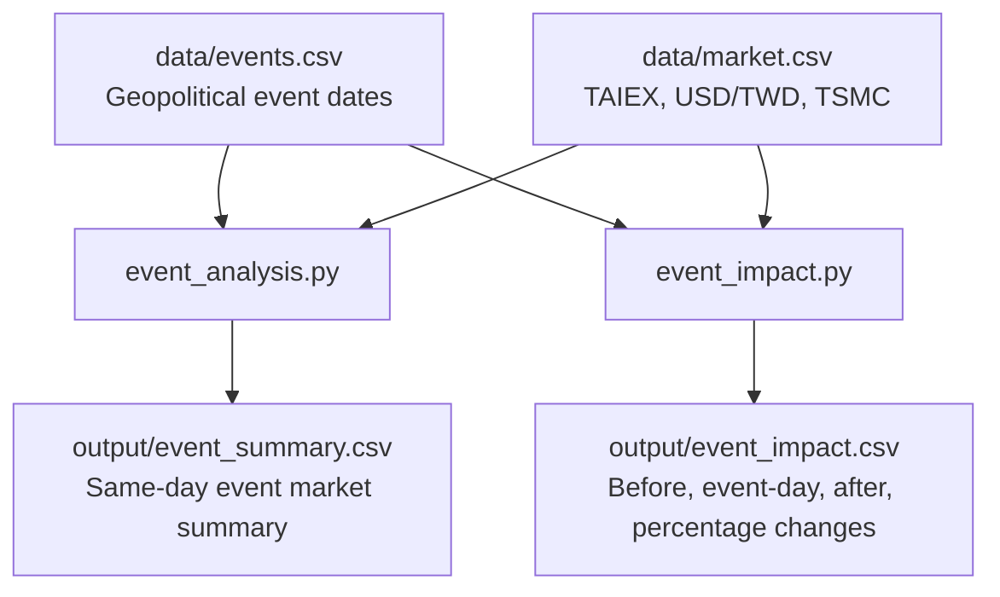

# Research Framework

## Research Question

How does geopolitical risk affect Taiwan financial markets?

## Core Idea

This project treats geopolitical events as shocks and examines how Taiwan financial markets behave around those dates. The current workflow focuses on three market indicators:

| Market Variable | Meaning |
| --- | --- |
| `taiex` | Taiwan stock market benchmark. |
| `usd_twd` | U.S. dollar to New Taiwan dollar exchange rate. |
| `tsmc` | TSMC stock price as a semiconductor-sector indicator. |

## Geopolitical Risk Events

Events are stored in `data/events.csv`.

| Event Type | Example |
| --- | --- |
| Taiwan Strait crisis | Missile Crisis, Pelosi Visit. |
| Election or leadership transition | Taiwan Election, Trump Inauguration. |
| Economic or regulatory pressure | China Remittance Rule. |

## Data Inputs

| File | Purpose |
| --- | --- |
| `data/events.csv` | Lists geopolitical risk events by date. |
| `data/market.csv` | Lists market data for TAIEX, USD/TWD, and TSMC by date. |

## Analysis Steps

1. Match each geopolitical event to same-day market data.
2. Compare market values one day before, on the event day, and one day after.
3. Calculate percentage change for TAIEX, USD/TWD, and TSMC.
4. Save summary outputs for interpretation.

## Scripts

| Script | Function | Output |
| --- | --- | --- |
| `event_analysis.py` | Matches each event date with same-day market values. | `output/event_summary.csv` |
| `event_impact.py` | Calculates before, event-day, after, and percentage change for each market variable. | `output/event_impact.csv` |

## Expected Outputs

| Output File | Description |
| --- | --- |
| `output/event_summary.csv` | Event-level table with same-day values for `taiex`, `usd_twd`, and `tsmc`. |
| `output/event_impact.csv` | Event-window table with before/event-day/after values and percentage changes. |

## Interpretation

The project can be used to identify whether major geopolitical risk events are associated with:

1. Declines or volatility in the Taiwan equity market.
2. Depreciation or appreciation pressure in the New Taiwan dollar.
3. Repricing of TSMC as a semiconductor-sector proxy.

Positive or negative percentage changes should be interpreted carefully because the sample data is illustrative. For stronger conclusions, the dataset should be expanded with real historical market prices and more event windows.

## Workflow Diagram

