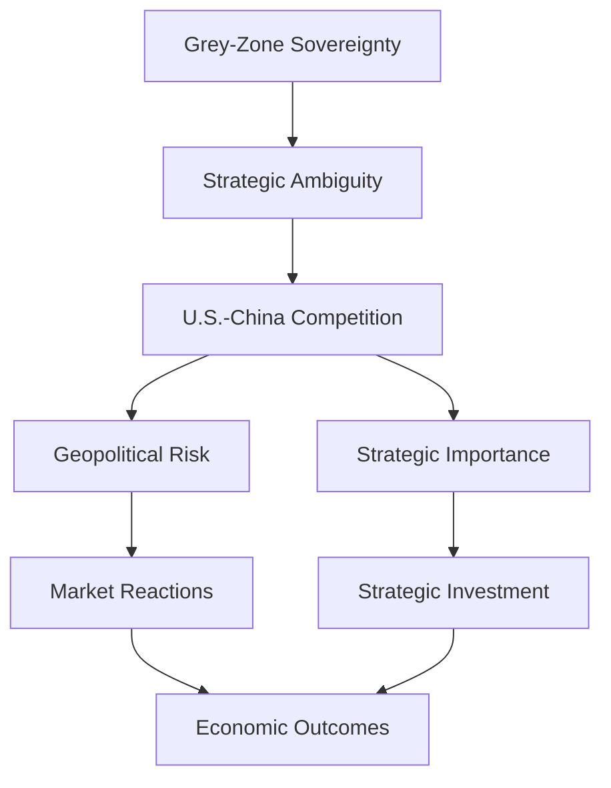
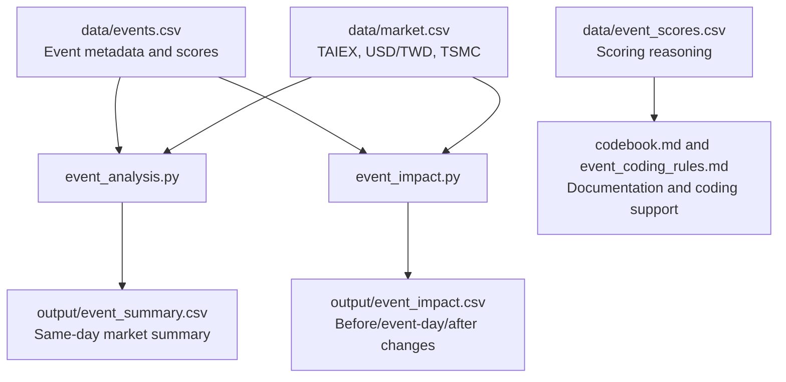

# Research Framework V2

## Research Question

How does geopolitical risk affect Taiwan financial markets?

## Research Design

This project uses an event-study structure. Geopolitical and strategic events related to Taiwan are treated as shocks. Market data is then matched to each event date to examine same-day values and short-run changes around the event.

## Conceptual Framework

## Main Hypothesis

Higher geopolitical risk is associated with stronger market reactions in Taiwan financial markets.

Expected market reactions may include:

1. Lower TAIEX values or negative TAIEX percentage changes.
2. Higher USD/TWD values if the New Taiwan dollar weakens against the U.S. dollar.
3. Lower TSMC values if semiconductor-sector risk rises.

## Key Variables

### Independent Variables

| Variable | Source | Measurement |
| --- | --- | --- |
| Geopolitical risk | `data/events.csv`, `data/event_scores.csv` | `risk_level`, coded from 1 to 5. |
| Strategic importance | `data/events.csv`, `data/event_scores.csv` | `strategic_value`, coded from 1 to 5. |
| Event type | `data/events.csv` | Category such as diplomatic, political, or investment. |

### Dependent Variables

| Variable | Source | Measurement |
| --- | --- | --- |
| TAIEX market reaction | `data/market.csv` | Same-day value and percentage change around event date. |
| USD/TWD exchange-rate reaction | `data/market.csv` | Same-day value and percentage change around event date. |
| TSMC semiconductor-sector reaction | `data/market.csv` | Same-day value and percentage change around event date. |

## Data Inputs

| File | Role |
| --- | --- |
| `data/events.csv` | Main event dataset with date, event name, event type, risk level, strategic value, and source. |
| `data/event_scores.csv` | Scoring dataset with event-level reasoning for `risk_level` and `strategic_value`. |
| `data/market.csv` | Market dataset with TAIEX, USD/TWD, and TSMC values by date. |

## Analysis Scripts

| Script | Purpose | Output |
| --- | --- | --- |
| `event_analysis.py` | Merges each event with same-day market data. | `output/event_summary.csv` |
| `event_impact.py` | Calculates one-day-before, event-day, and one-day-after market changes. | `output/event_impact.csv` |

## Output Files

| File | Description |
| --- | --- |
| `output/event_summary.csv` | Same-day market values for each event. |
| `output/event_impact.csv` | Event-window market values and percentage changes for TAIEX, USD/TWD, and TSMC. |

## Coding Rules

Event coding follows `event_coding_rules.md`.

When assigning `risk_level` or `strategic_value`:

1. Never guess silently.
2. Provide a short justification.
3. Flag uncertain cases for manual review.
4. Return `event_name`, `risk_level`, `strategic_value`, and `reasoning`.

## Workflow

## Interpretation Strategy

The analysis compares market behavior across events with different `risk_level` and `strategic_value` scores.

Possible interpretations:

1. If high-risk events show negative TAIEX or TSMC changes, this may suggest geopolitical risk depresses Taiwan equity valuations.
2. If high-risk events show positive USD/TWD changes, this may suggest depreciation pressure on the New Taiwan dollar.
3. If high-strategic-value events show positive TSMC or TAIEX reactions, this may suggest markets reward Taiwan's strategic role in AI and semiconductor supply chains.

Because the current market data is illustrative, results should be treated as a workflow demonstration until real historical data is added.
