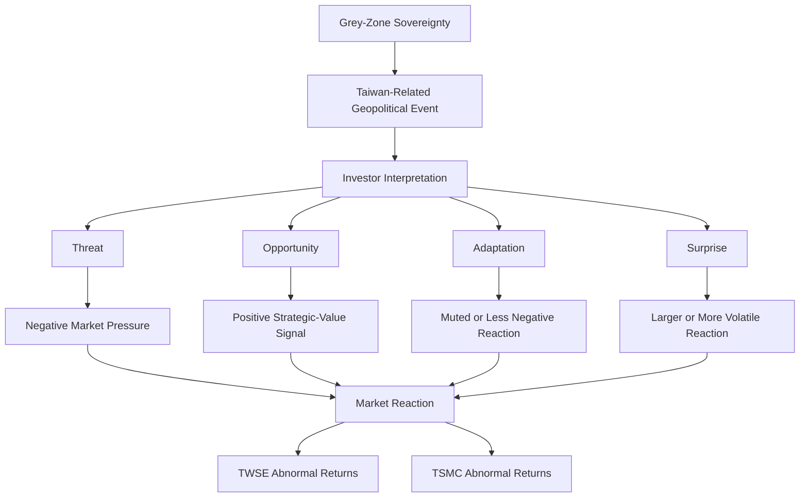

# Revised Theory Diagram

## Original Framework

```text
Grey-Zone Sovereignty
        ↓
Risk
        ↓
Market Reaction
```

## Revised Framework

```text
Grey-Zone Sovereignty
        ↓
Geopolitical Event
        ↓
Investor Interpretation
        ├── Threat
        ├── Opportunity
        ├── Adaptation
        └── Surprise
        ↓
Market Reaction
```

## Expanded Diagram



## Core Revision

The revised theory adds an interpretation layer between geopolitical events and market reactions. This layer is necessary because the empirical patterns do not show a uniform relationship between risk and negative abnormal returns.

## Interpretation Channels

| channel | meaning |
| --- | --- |
| Threat | Investors interpret the event as escalation, coercion, or instability. |
| Opportunity | Investors interpret the event as evidence of Taiwan's strategic importance. |
| Adaptation | Investors interpret the event as part of a repeated and familiar grey-zone pattern. |
| Surprise | Investors interpret the event as less expected or more disruptive than anticipated. |

## Asset-Specific Reaction

TWSE and TSMC should be analyzed separately. TWSE may capture broader Taiwan market risk, while TSMC may also capture semiconductor-specific expectations, global technology competition, and supply-chain policy support.
