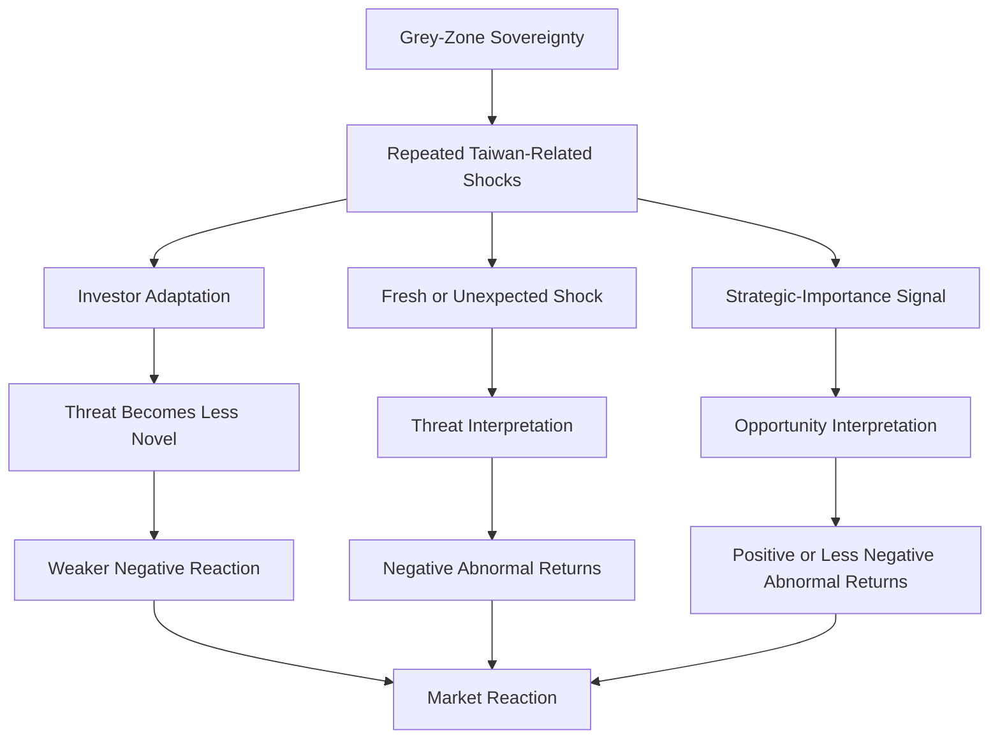

# Theory Diagram V3

## Parsimonious Theory

```text
Grey-Zone Sovereignty
        ↓
Repeated Geopolitical Shocks
        ↓
Investor Adaptation
        ↓
Market Reaction
```

## Expanded but Still Parsimonious Version



## Core Claim

The primary pathway is adaptation:

```text
Repeated shocks reduce novelty.
Reduced novelty weakens threat interpretation.
Weaker threat interpretation reduces market damage.
```

## Role of Other Mechanisms

| mechanism | role in theory | status |
| --- | --- | --- |
| Adaptation | Explains why repeated high-risk shocks may become less damaging. | Primary |
| Threat | Explains why Risk events are negative on average. | Secondary baseline |
| Opportunity | Explains positive Strategic_Importance events. | Secondary extension |
| Surprise | Explains why some reactions may be larger than others. | Conditioning factor |

## Rejected Simple Model

The current evidence does not support this as the full theory:

```text
Grey-Zone Sovereignty
        ↓
Risk
        ↓
Market Reaction
```

That model explains the negative average for Risk events, but it does not explain positive returns after some military demonstrations.

## Preferred Minimal Model

```text
Grey-Zone Sovereignty
        ↓
Recurring Grey-Zone Events
        ↓
Market Learning / Adaptation
        ↓
Less Uniformly Negative Market Reaction
```
